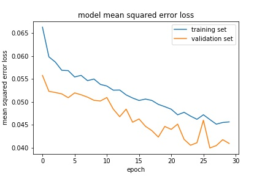

# **Behavioral Cloning** 

## Writeup Template

### You can use this file as a template for your writeup if you want to submit it as a markdown file, but feel free to use some other method and submit a pdf if you prefer.

---

**Behavioral Cloning Project**

The goals / steps of this project are the following:
* Use the simulator to collect data of good driving behavior
* Build, a convolution neural network in Keras that predicts steering angles from images
* Train and validate the model with a training and validation set
* Test that the model successfully drives around track one without leaving the road
* Summarize the results with a written report


[//]: # "Image References"

[image1]: ./examples/placeholder.png "Model Visualization"
[image2]: ./examples/placeholder.png "Grayscaling"
[image3]: ./examples/placeholder_small.png "Recovery Image"
[image4]: ./examples/placeholder_small.png "Recovery Image"
[image5]: ./examples/placeholder_small.png "Recovery Image"
[image6]: ./examples/placeholder_small.png "Normal Image"
[image7]: ./examples/placeholder_small.png "Flipped Image"

## Rubric Points
### Here I will consider the [rubric points](https://review.udacity.com/#!/rubrics/432/view) individually and describe how I addressed each point in my implementation.  

---
### Files Submitted & Code Quality

#### 1. Submission includes all required files and can be used to run the simulator in autonomous mode

My project includes the following files:
* model.py containing the script to create and train the model. Also, model.ipynb along with HTML is also uploaded which corresponds to the same.
* drive.py for driving the car in autonomous mode
* model.h5 containing a trained convolution neural network 
* writeup_report.md summarizing the results

#### 2. Submission includes functional code
Using the Udacity provided simulator and my drive.py file, the car can be driven autonomously around the track by executing 
```sh
python drive.py model.h5
```

#### 3. Submission code is usable and readable

The model.py file contains the code for training and saving the convolution neural network. The file shows the implementation used for training and validating the model, and it contains comments to explain how the code works.

### Model Architecture and Training Strategy

#### 1. An appropriate model architecture has been employed

I have used well known implementation and also as suggested by course i.e.. Nivida Architecture. The model features five convolutional layers and four fully-connected layers.

The model includes RELU layers to introduce nonlinearity  and the data is normalized in the model using a Keras lambda layer.

![Nvidia]: https://arxiv.org/pdf/1604.07316v1.pdf


#### 2. Attempts to reduce overfitting in the model

Each convolutional layer and fully-connected layer has RELU activation, and a dropout layer with 30% drop-rate is implemented after each convolutional layer to avoid overfitting in the network layered architecture.

The model was trained to reduce mean squared error. The visualization of trained and validation data MSE error look like this

The model was tested by running it through the simulator and ensuring that the vehicle could stay on the track.

#### 3. Model parameter tuning

The model used an adam optimizer, so the learning rate was not tuned manually. The number of epochs used are 30 and of batch_size= 64.

#### 4. Appropriate training data

Training data was chosen to keep the vehicle driving on the road. I used a combination of center lane driving, recovering from the left and right sides of the road with adding a correction factor as suggested in course to the center lane steering.

For details about how I created the training data, see the next section. 

### Model Architecture and Training Strategy

#### 1. Solution Design Approach

A simulator was run to collect in track1 by driving forward and backward. Also, tried to collect some data by driving in track2 which was bit hard though.

- I used the the dataset obtained by driving in simulator and didn't use the one provided by udacity. Training data was split with ratio of 20% to get the validation data
- I am using mpimg to load the images as they are RGB format based
- Since the steering angle is associated with three images a correction factor was introduced for left and right images since the steering angle is captured by the center angle
- As mentioned above,a correction factor of 0.2 is used. For the left images, the steering angle is increased by 0.2 and for the right images its decreased  by 0.2

The overall strategy for deriving a model architecture was to make sure vehicle drives on the road tried best to keep it on the center of road.

My first step was to use a convolution neural network model similar to the one proposed in course with only one one layer I thought this model should be ok but realized it does perform poor on both training and validation so decided to increase the convolution layers.

In order to gauge how well the model was working, I split my image and steering angle data into a training and validation set. I found that my first model had a low mean squared error on the training set but a high mean squared error on the validation set. This implied that the model was overfitting. 

To combat the overfitting, I modified the model by adding dropout layers with drop-rate of 30% to each convolutional layer and fully-connected layer with RELU activation.

Then I observed that model was performing well of course with increasing epochs it helped to perform better and reducing batch_size as well. I tried with batch_size of 128, 256 but decided to keep 64 as it was performing better.

The final step was to run the simulator to see how well the car was driving around track one. There were a few spots where the vehicle fell off the track to improve the driving behavior in these cases, I considered the correction factor to left and right images. Without these corrections the probability of vehicle going off-track is quite high.

At the end of the process, the vehicle is able to drive autonomously around the track without leaving the road. The link to video can be found here 


![Video]:run1.mp4


#### 2. Final Model Architecture

The final model architecture consisted of a convolution neural network with the following layers and layer sizes.

| Layers  | Description                                     |
| :------ | ----------------------------------------------- |
| Conv2D  | Output=24x5x5, Strides, 2x2, Activation = RELU  |
| Dropout | rate = 0.3                                      |
| Conv2D  | Output=36x5x5, Strides, 2x2, Activation = RELU  |
| Dropout | rate = 0.3                                      |
| Conv2D  | Output= 48x5x5, Strides, 2x2, Activation = RELU |
| Dropout | rate = 0.3                                      |
| Conv2D  | Output=64x3x3, Activation = RELU                |
| Dropout | rate = 0.3                                      |
| Conv2D  | Output=64x3x3, Activation = RELU                |
| Dropout | rate = 0.3                                      |
| Flatten | -                                               |
| Dropout | rate = 0.3                                      |
| Dense   | 1162, Activation =RELU                          |
| Dropout | rate = 0.3                                      |
| Dense   | 100,Activation =RELU                            |
| Dropout | rate = 0.3                                      |
| Dense   | 50, Activation =RELU                            |
| Dropout | rate = 0.3                                      |
| Dense   | 10,Activation =RELU                             |
| Dropout | rate = 0.3                                      |
| Dense   | 1,Activation =RELU                              |
| Dropout | rate = 0.3                                      |

#### 3. Creation of the Training Set & Training Process

To capture good driving behavior, I first recorded on track by driving forward with trying best to cover center, left and right behavior. Second time, i collected data by driving in the reverse direction on first track.

Finally, i tried to collect data by driving on second track which was very hard so could drive only for sometime. All these collected data were merged into single driving_log.csv to use it for training the model.

I did collect more data by driving around with simulator more than 3 times and finally fixed the data collected which was performing well on model and deleted rest.

After the collection process, I have used very basic techniques as pre-processing ones, considered only normalization and cropping of images as it was sufficient for the project. Of course, data augmentation might help to improve techniques such as brightness, flipping images etc.,


I finally randomly shuffled the data set and put 20% of the data into a validation set. 

I used this training data for training the model. The validation set helped determine if the model was over or under fitting. The ideal number of epochs was 30 with batch_Size = 30 was used. I used an adam optimizer so that manually training the learning rate wasn't necessary.
